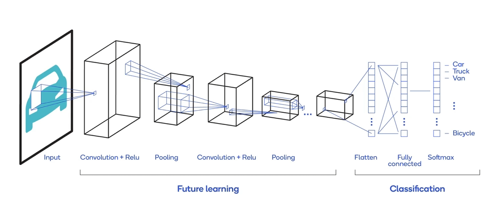
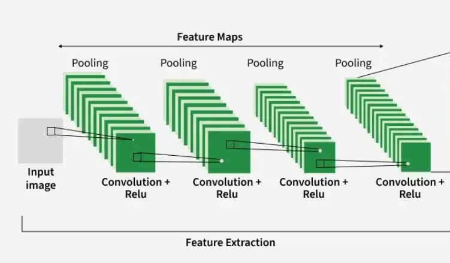
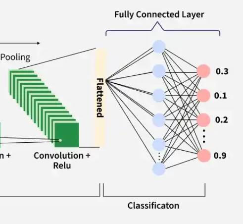
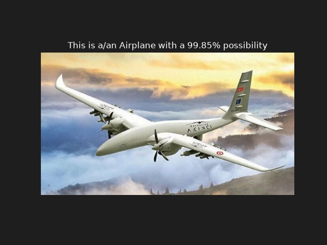
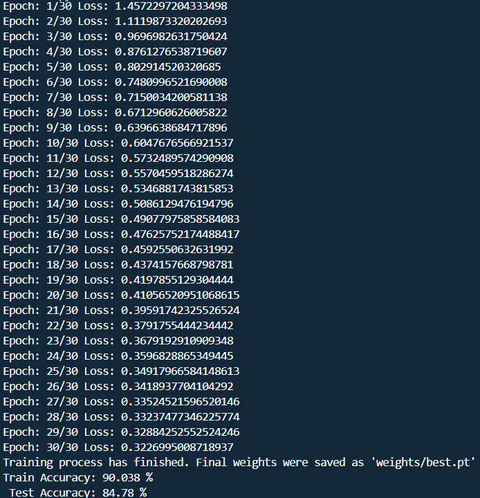
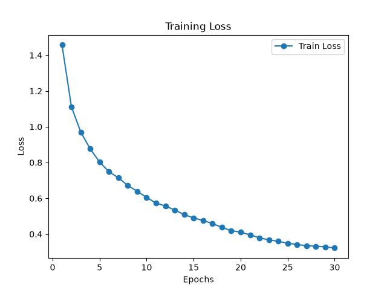

>Language: English 🇺🇸<br>

For Turkish: [Turkish](README_tr.md)


# Description
 Im glad to present another Deep Learning project which is about CNN (Convolutional Neural Network). The trained model in this project, is currently able to predict objects in images accurately from 10 different classes.<br>

 This time we do not only use classic ANN. Because the model needs a more complex structure in order to learn the features of complex images. This is exactly what CNNs are made for. You will find every required detail to fully understand the model's working logic in this project. CNN structure was also explained clearly.<br>

---

# What is CNN (Convolutional Neural Network)?
 If i had to use an analogy for the definition of CNN, i would say that CNN is the big brother of ANN. Because CNN is basically a more complex version of ANN. Although it includes classic ANN in the final phase, what makes it different from ANN is additional Convolution layers. These layers are used to extract features from images. Thus, ANN takes extracted features as inputs instead of random pixels.<br>


>Image 1.1: CNN Logic

## CNN Learning Steps
Learning steps are consist of two main phases:
- **Feature Extraction Phase** (Convolution Layers)
- **Classification Phase** (Classic ANN)

### 1- Feature extraction phase
Feature extraction phase is consist of four steps:
- **Convolution Filters**: Feature extraction phase is the most critical one since it includes Convolution filters so-called kernels (matrices). Each kernel creates one feature-map after its processes. They generally have a 3x3 shape. Each matrix's task is to look for one spesific feature (like vertical lines) in coming image (32x32). Convolution filter (3x3) applies its weights to each 3x3 area in three channels (RGB) of each image. Then, it adds three different results together to get one numeric value. This value indicates how prominent wanted feature (vertical lines) is in that spesific area. Each filter does the same thing to each 3x3 area in the 32x32 image until it completed each value in its feature map.<br>

- **Batch Normalization**: Same filter is applied to each image in the batch. For a batch which includes 64 images, it collects all 64 feature maps created by one spesific filter. Batch normalization does not only use 64 images, it also includes all pixels (height and width) in these feature maps. It sums all of these values together to calculate one mean and variance for that spesific feature (like vertical lines). Then, it normalizes each numeric value using this mean and variance. Finally, it applies two learnable parameters (scale and shift) to keep nonlinear properties of the network. Each 32 feature map does this same process independently after convolution phase.
- **Activation Function (ReLU)**: Takes each value in 32 feture maps and changes those which are negative to zero. It does not change positive values. Basically the lowest value in the feature maps becomes zero (0) after ReLU.
- **Pooling**: It basically cuts off half of the pixels in the feature maps (reshapes feature maps). There are two variations of pooling. Both uses 2x2 kernels with two pixel steps (stride=2) every time:
    - **Max Pooling**: Takes the highest value in the 2x2 area.
    - **Average Pooling**: Takes the average of four values in the 2x2 area.

These four steps are applied in a row for each layer in the feature extraction phase. Two to four loops is enough in general. More can be applied where it is needed. While the number of the feature maps is doubled after each loop, shape of the feature maps is divided 50/50.

>Image 1.2: Conv-BN-ReLU-Pooling steps.

### 2- Classification Phase (Fully Connected Layers)
Classification phase, uses as the same structure as classic ANN does. Since ANN takes a 1D vector as input, we have to apply flatten after the last conv loop:
  - What is '*flatten*' and why do we apply it?
    - Each convolution loop returns a tensor which has four dimension. For example, after the third loop, we have this tensor:  [64,128,8,8]<br> 
    In this tensor;<br> 
    First index➡️ indicates batch size<br>
    Second index ➡️ indicates the current number of feature maps<br>
    Last two index➡️ indicates the current shape of feature maps. (8x8)<br>

With this tensor which includes four dimensions, ANN (decision maker) can not work. Because it only takes 1D vectors as input. Flatten function's snytax and its parameters can be observed in [classes.py](classes.py).<br>

>Image 1.3: Classification phase

- Remainder of the network has nothing complex. Classic ANN process follows;
  - 1D vector ➡️ Fully Connected Layer ➡️ ReLU ➡️ Dropout <br>
>[!NOTE]
> Generally, two fully connected layers are enough to feed the model's accuracy in decision making as long as its feature extraction phase is created talented enough. Dropout is optional in fully connected layers. But it is usually a sector standart to use it in order to prevent overfitting.

## Model Training Details
No ready-to-use model was used during the training process. Every step was taken originally. The model was built from scratch as you can observe in the given `.py` files.<br>

**Model**:`Convolutional Neural Network`<br> 
**Task**:`Identifying Object Classes`<br>
**Epoch**:`30`<br>
**Dataset**: 🔍[CIFAR-10](https://cave.cs.toronto.edu/kriz/cifar.html)<br>
**Input Image Shape**`:32x32`<br>
**Tech stack**:,,,<br>
>[!IMPORTANT]
> Dataset (CIFAR-10) was not used directly. A series of pre-processes were applied during the data loading phase:
```python
 transform=transforms.Compose([transforms.RandomCrop(32, padding=4),
        transforms.RandomHorizontalFlip(),
        transforms.ToTensor(), 
        transforms.Normalize(((0.5,0.5,0.5)),(0.5,0.5,0.5))
    ])
```
- These transform processes are vital in order to prevent overfitting by simply applying augmentation to the dataset.

# Model Outputs
In order to assess the model's accuracy with an image which was not seen by the model before, an airplane image was given to the model.
<div align="center">
  <h4>TEST IMAGE</h4>
  
</div>
<div align="center">
  <h4>MODEL OUTPUT</h4>
  
</div>

## Performance Evaluation
- The model was trained for 30 epochs. Because i experienced *overfitting* during the first tries, it took me some time to determine the proper number of epoch. Actually i tried to change different parameters trying to eliminate *overfitting*. You will see all the obstacles that i encountered in the following header. The challenge was to find the perfect balance between *underfitting* and *overfitting*. When i found the best parameters providing the least loss value, i realized that CNN models have a limit in terms of accuracy values. Here are the best values i reached so far:<br>




- I deployed some kind of *overfitting* detector inside main.py function which was not very hard to devise:
```python
# 8 - Check both values in order to detect possible overfitting
    print(f"Train Accuracy: {train_accuracy} % \n Test Accuracy: {test_accuracy} % ")
    if train_accuracy-test_accuracy>10:
        print(f"Possible Overfitting has been detected. You might consider changing epoch number.")
```
and the message in the print() function, appeared in the terminal more than i guessed during the early training stages. You can analyze the problems and solutions i tried beneath the next header.

#### Setbacks and failures
First of all, i have discovered a lot of new details about AI models in this project. I deployed variety of solutions against *overfitting* and *underfitting*.
- I started traninig with 15 epochs which caused *underfitting*. Peak accuracy values were somewhere between 60%-70% and that was quite unsufficient. Then, i tried to make it 25 epochs and that caused *overfitting*. The model had learned the training dataset well but the difference between training and test accuracies had peaked with 10%-15%.
- After that, i decided to add batch normalization which i had not used until that time. It speeded up the model's learning but leaded to a more serious *overfitting* problem which i could not solve until i decided to apply *Data Augmentation*.
- Since *Overfitting* became the biggest issue after BN was deployed in the Convolution Layers, i had to use some *Data Augmentation* functions in order to diversify the training dataset which were aforementioned here: [Model Training Details](#model-training-details).
- With that, the model had settled in a stronger position where *Overfitting* was not a big issue anymore. The next goal was to reach the lowest loss value possible because i thought that the model had a greater capacity after *Data Augmentation*. In order to achieve that, i changed two parameters' values which i thought were limiting the model's capacity:  
  - Dropout = 0.5 > 0.2
  - lr = 0.01 > 0.1

- These two modifications leaded to a problem that i had not experienced before. That was *Overshooting* which is caused by high learning rates. In that case,The model updates its weights enormously and misses the perfect weight values. Loss value was stuck at 2.30 and was not decreasing. To cope with that, i changed *lr* value back to 0.01. Dropout = 0.2 was doing good decreasing loss values but still there was a little *overfitting*.
- So i deployed a *scheduler* using *StepLR* algorithm in order to reduce *lr* value by 50/50 after a certain point. It solved the remaining *overfitting* problem. But i knew that i could go further.  

- To bring the model to the next level, i added two more Conv layers (conv-bn-relu-pooling). It served well and the model started to extract more features out of the image. As you can guess, training loss value decreased and accuracies increased dramatically.
- For the final touch, i started to use *CosineAnnealingLR* as scheduler. This helped me by reducing the *lr* slowly like an airplane landing (softly) instead of applying instant decrease to the *lr* value. So, the loss value progressively landed to a safer level.<br>

Finally, i have reached the most reliable loss and accuracy values [Performance Evaluation](#performance-evaluation). These levels are also known as the limit for a CNN-based model without using any pre-trained model like ResNet.

#### The next station for the CNNs
In order to serve my curiosity, i am going to include a pre-trained by model using Transfer Learning to see the realest limit of the CNNS.

## Installation and usage
You can give it a try by copying this repo to your local computer and see how accurate the model can be predicting 10 different classes.<br>
1-
```bash
#Clone the repo to your local computer.
git clone https://github.com/halileroglu711/CNN-classification.git
```
2-
```bash
#Enter to the project folder.
cd CNN-classification
```
3-
```bash
#Install the required libraries.
pip install -r requirements.txt
```
4-
```bash
#Start training to see loss and accuracy values yourself.
python main.py
```
5-
```python
#Test the model.
python test.py
```
>```You can test the model with your own image. Just change the Image.open() parameter with your image: img=Image.open("assets/akinci.png").convert("RGB") ```

### Project folder structure
```text
CNN-classification/
│
├── assets/
│     ├──cnn-visualization.png
│     ├──conv-layer.png
│     ├──classification-phase.png
│     ├──akinci.png
│     ├──model-output.png
│     ├──accuracy-values.png
│     ├──random-sample-images.png
│     └──training-loss-graph.png
│
│
├── weights/
│      └── best.pt
│
├── .gitignore
├── classes.py
├── functions.py
├── main.py
├── README_tr.md
├── README.md
├── requirements.txt
└── test.py
```
### 💼 License
This project is licensed under the **MIT License**. <br>
Check the [LICENSE](LICENSE) file for further detail.

### 📬 Contact
- Let me know if i have done any mistakes 🙋. Im waiting for your contributions 🙂. Here is where you can find me:

[](https://www.linkedin.com/in/halil-ero%C4%9Flu-5505783a1)
[](https://github.com/halileroglu711)
[](mailto:halileroglu711@gmail.com)


